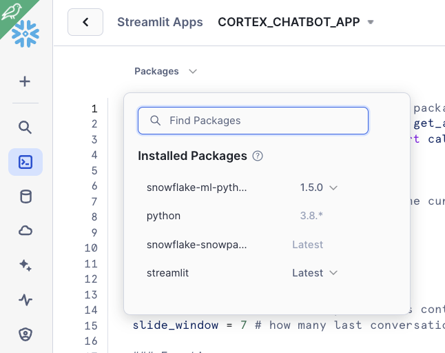

# Build a Retrieval Augmented Generation (RAG) based LLM assistant using Streamlit and Snowflake Cortex

# Resources
This page provide additional files for the quick start  [Build a Retrieval Augmented Generation (RAG) based LLM assistant using Streamlit and Snowflake Cortex](https://quickstarts.snowflake.com/guide/asking_questions_to_your_own_documents_with_snowflake_cortex/index.html?index=..%2F..index#0).

The guide uses SELECT commands to create ebeddings and call LLMs within Snowflake. That is also possible using Snowpark Dataframes and Python API calls to Complete function.

For those more fancy to use Python instead of SQL, here is one example of the:

- [Chat UI](cc_cortex_app.py)
- [Chatbot UI](cc_cortex_chatbot.py)

That code is ready to run in Streamlit in Snowflake. Just copy and paste in your Streamlit App and you are ready to go.

Note that in order to use Complete() function in Streamlit in Snowflake you need to specify the snowflake-ml-python package:

