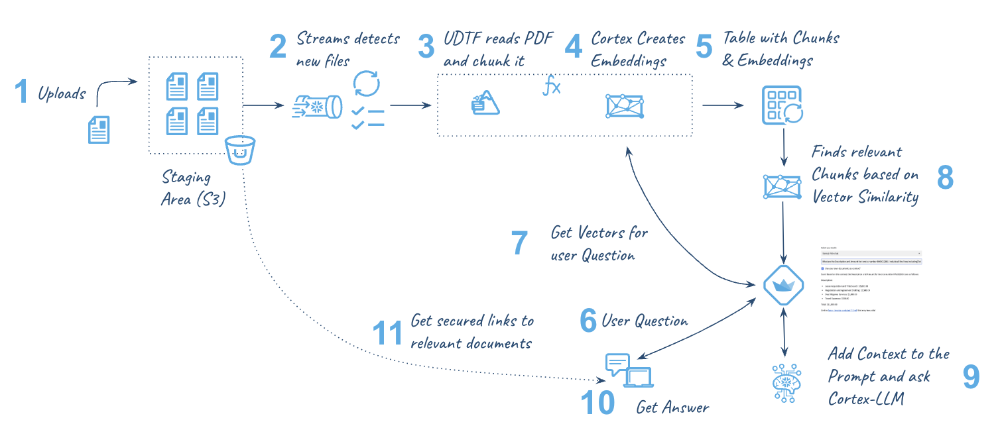

# Asking Questions to Your Own Documents with Snowflake Cortex

This is the code for the example provide in this : 

In order to setup this demo you need:

- Access to Snowflake Cortex
- Access to Snowflake Notebooks (both in Private Preview)

use database CC_DOCUMENTS;
create schema data2;

create or replace stage docs ENCRYPTION = (TYPE = 'SNOWFLAKE_SSE') DIRECTORY = ( ENABLE = true );

Create a notebook and a Streamlit app in that database and schema (or use you own choice).

Upload some pdf files into that docs stage.

