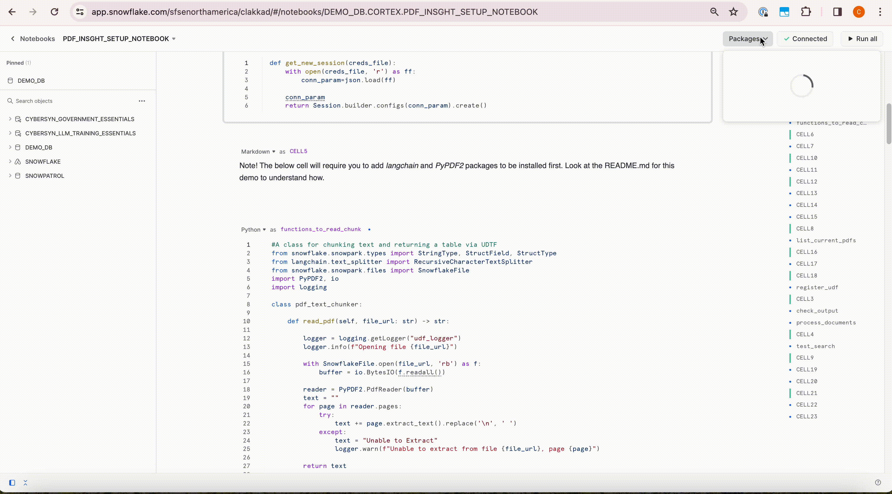

# Asking Questions to Your Own Documents with Snowflake Cortex

# Resources
This is the code for the example provide in this [blog entry](https://carlos-carrero-marin.medium.com/asking-questions-to-your-own-documents-with-snowflake-cortex-56c67922bed8).

# Setup

In order to setup this demo you need:
- Access to Snowflake [Cortex functions (PrPr)](https://docs.snowflake.com/LIMITEDACCESS/cortex-functions)

- Your local IDE with the environment setup or [Snowflake Notebooks (PrPr)](https://docs.snowflake.com/LIMITEDACCESS/snowsight-notebooks/ui-snowsight-notebooks-about)

## Setup through Snowflake Notebooks

    1. Open Notebooks UI from the left panel on Snowsight home

    2. Click the icon *next* to '+ Notebook' to import the ipynb file provided with repo to Snowflake

    3. Select the database, schema , and warehouse to use to create/run this Notebook under.
    
    4. Make sure that all code based cells are loaded as 'Python' cells and not 'SQL'. Markdown based cells should be loaded as 'Markdown'
    
    5. Run all the cells in the notebook [pdf_insght_setup_notebook.ipynb](./pdf_insght_setup_notebook.ipynb)

### How to install packages within your notebook

## Setup from local IDE

    1. Create a conda environment using the [local_environment.yml](./local_environment.yml)

    2. In your local Notebook IDE, select the newly created conda environment as your IPython Kernel

    3. Run all the cells in the notebook [pdf_insght_setup_notebook.ipynb](./pdf_insght_setup_notebook.ipynb)

# Architecture

# Demo flow
- Login to Snowflake as the user with access to the database/schema/warehouse